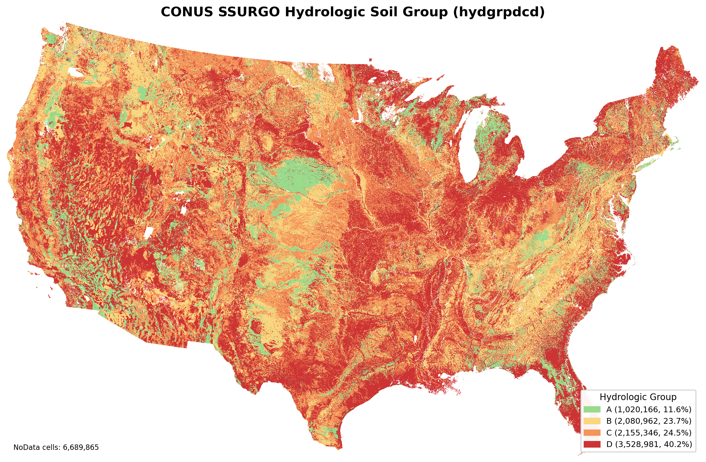

# hydgrpdcd Raster Builder

> Build a CONUS hydrologic soil group (HSG) raster (`hydgrpdcd.tif`) aligned to the gNATSGSO mukey grid for Geneva NoDb workflows.



## Overview

This directory contains a reproducible pipeline that converts the gNATSGSO mukey raster into a coded HSG raster:

- Input grid: `/home/geodata/ssurgo/gNATSGSO/2025/gNATSGO_mukey_202502.tif`
- Output grid: `/home/geodata/ssurgo/hydgrpdcd/hydgrpdcd.tif`
- Intended downstream use: `wepppy/nodb/mods/geneva/specification.md` (US v1 HSG handling contract)

The builder queries USDA NRCS SDA live data and applies staged fallback logic so unresolved map-unit HSG values can still be derived when possible.

## Files

- `build_hydgrpdcd.py`: main generator
- `tests/test_build_hydgrpdcd.py`: sanity tests for mapping and raster behavior
- `hydgrpdcd.tif`: generated HSG raster (GeoTIFF, `Byte`, NoData=`0`)
- `hydgrpdcd_map.png`: quicklook PNG map of raster classes
- `hydgrpdcd_lookup.csv`: per-mukey audit table with raw source and normalized code
- `hydgrpdcd_metadata.json`: run metadata, fallback statistics, and raster class counts
- `_6_make_hydgrpdcd_map.py`: script to render `hydgrpdcd_map.png`

## Codebook

Raster values:

- `0`: NoData / unresolved
- `1`: A
- `2`: B
- `3`: C
- `4`: D

Current generated raster (`hydgrpdcd.tif`) contains only codes `0, 1, 2, 3, 4`.
Codes `5`, `6`, and `7` are not used in this product.

## Fallback Order

For each mukey, the script uses the first successful source in this order:

1. `muaggatt.hydgrpdcd` (SDA)
2. dominant `component.hydgrp` (highest `comppct_r`)
3. component/horizon fallback using `chorizon.sandtotal_r` + `chorizon.claytotal_r` with WEPPpy-style 4-class simple texture classification

Texture-to-HSG map (US v1):

- `sand loam -> B`
- `loam -> B`
- `silt loam -> C`
- `clay loam -> D`

Dual groups (`A/D`, `B/D`, `C/D`) are controlled by `--dual-group-policy`:

- `assume_d` (default): map to `D`
- `error`: keep unresolved

## Requirements

- Python 3
- `numpy`
- `requests`
- GDAL/OGR Python bindings (`osgeo`)
- Network access to SDA:
  - `https://SDMDataAccess.nrcs.usda.gov/Tabular/post.rest`

For tests:

- `pytest`

## Usage

From this directory:

```bash
cd /home/geodata/ssurgo/hydgrpdcd
```

Incremental run (reuses existing lookup cache if present):

```bash
python build_hydgrpdcd.py
```

Full rebuild from SDA (ignore existing lookup cache):

```bash
python build_hydgrpdcd.py --refresh-lookup
```

Common options:

```bash
python build_hydgrpdcd.py \
  --dual-group-policy assume_d \
  --batch-size 2000 \
  --timeout-seconds 60 \
  --max-retries 4 \
  --component-fallback \
  --chorizon-fallback
```

Disable fallback stages if needed:

```bash
python build_hydgrpdcd.py --no-component-fallback --no-chorizon-fallback
```

## Testing

```bash
python -m pytest -q /home/geodata/ssurgo/hydgrpdcd/tests
```

## Validation Checks

Quick raster sanity:

```bash
gdalinfo /home/geodata/ssurgo/hydgrpdcd/hydgrpdcd.tif
```

Review fallback and class coverage:

```bash
cat /home/geodata/ssurgo/hydgrpdcd/hydgrpdcd_metadata.json
```

Render/re-render the quicklook map:

```bash
python /home/geodata/ssurgo/hydgrpdcd/_6_make_hydgrpdcd_map.py \
  --input /home/geodata/ssurgo/hydgrpdcd/hydgrpdcd.tif \
  --output /home/geodata/ssurgo/hydgrpdcd/hydgrpdcd_map.png
```

## Notes

- The local `wepppy/soils/ssurgo/data/surgo/surgo_tabular.db` cache is not treated as authoritative by this pipeline.
- `hydgrpdcd_lookup.csv` includes per-mukey provenance:
  - `raw_source` (`muaggatt`, `component_hydgrp_major`, `chorizon_chtexturegrp_fallback`)
  - `raw_detail` (texture fallback details when used)
